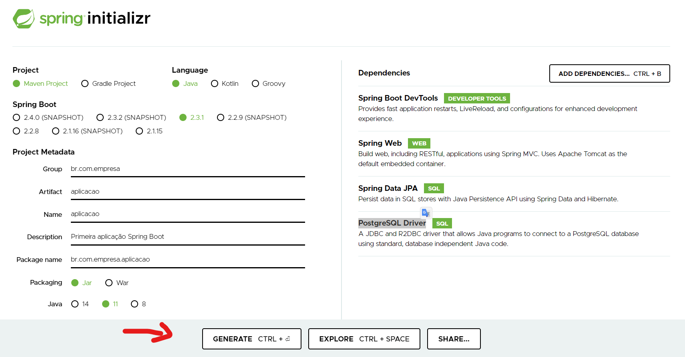

# Como criar um projeto Spring Boot

Entre no site [spring initializr](https://start.spring.io/)

Os seguintes campos estarão disponíveis:
- **Project** = Maven Project (Será quem encontrará as dependências e fará o build do projeto)
- **Language** = Java (Linguagem que o sistema será desenvolvido)
- **Spring Boot** = 2.3.1 (As versão que estão em SNAPSHOT são de testes, neste momento que estou fazendo o tutorial essa versão é a mais atual disponível)
- **Project Metadata**
1. Group = br.com.empresa
2. Artifact = aplicacao (O nome do projeto para o Maven é o group mais o artifact | Exemplo: br.com.empresa.aplicacao)
3. Name = aplicacao (O nome da pasta que o windows irá criar) 
4. Description = Primeira aplicação Spring Boot (Descreve sobre o que se trata o projeto)
5. Package name = br.com.empresa.aplicacao (Nome de como as pastas no windows serão criadas dentro do projeto)
- **Packaging** = Jar (Qual a extensão que o maven irá construir sua aplicação no final)
- **Java** = 11 (Versão do Java)
- **Dependencies** (Para o início utilizaremos o básico para criar uma aplicação web com acesso ao banco de dados)
1. Spring Boot DevTools 
2. Spring Web
3. Spring Data JPA 
4. PostgreSQL Driver

Após revisar as informações acima clique no botão GENERATE

---     

Será feito o download de um arquivo .ZIP, extraia a pasta para o workspace de sua IDE.

Neste exemplo utilizarei o Eclipse para fazer a importação do projeto
- Clique no menu File -> Import..
- Selecione Maven -> Existing Mave Projects e clique no botão em Next.
- Ao lado do campo Root Directory clique em Browse...
- Selecione o projeto que foi descompactado e clique em Selecionar pasta.
- Clique em Finish para colocar o projeto dentro do Eclipse, aguarde uns instantes enquanto a importação acontece.

---

Ao concluir você terá uma estrutura inicial do projeto contendo as pastas e arquivos dentro do projeto, os principais arquivos são:

- src/main/java/br/com/empresa/aplicacao.AplicacaoApplication.java = Faz a inicialização do sistema com spring boot
- src/main/resources/application.properties = Onde são feitas todas configurações para o spring boor iniciar
- src/test/java/br/com/empresa/aplicacao.AplicacaoApplicationTest.java = Onde são feitas as configurações para executar os testes 
- pom.xml = Neste arquivo possuímos as configurações do Maven, versão do Java, dependências e como será feito o build.

